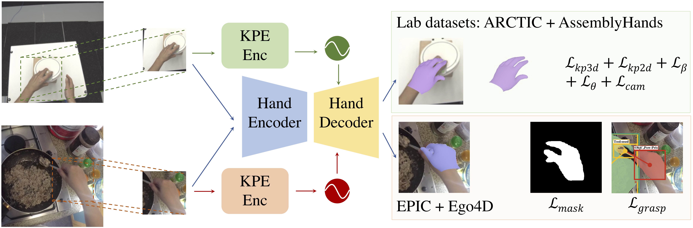

# 3D Hand Pose Estimation in Everyday Egocentric Images

## [Project Page](https://ap229997.github.io/projects/hands/) | [Paper](https://ap229997.github.io/projects/hands/assets/paper.pdf) | [Supplementary](https://ap229997.github.io/projects/hands/assets/suppmat.pdf) | [Video](https://youtu.be/YolFnTtq38E) | [Poster](https://ap229997.github.io/projects/hands/assets/poster.pdf)



This repository contains the code for the ECCV 2024 paper [3D Hand Pose Estimation in Everyday Egocentric Images](https://ap229997.github.io/projects/hands/assets/paper.pdf). If you find our code or paper useful, please cite
```bibtex
@inproceedings{Prakash2024Hands,
    author = {Prakash, Aditya and Tu, Ruisen and Chang, Matthew and Gupta, Saurabh},
    title = {3D Hand Pose Estimation in Everyday Egocentric Images},
    booktitle = {European Conference on Computer Vision (ECCV)},
    year = {2024}
}
```

## Demo

We provide a demo script for estimating hand poses from a single image using both [HaMeR](https://arxiv.org/abs/2312.05251) and [WildHands](https://arxiv.org/abs/2312.06583) models. The detailed instructions are provide in the [demo](https://github.com/ap229997/hands/tree/demo) branch.

## Setup

Follow the instructions in the [ARCTIC](https://github.com/zc-alexfan/arctic/blob/master/docs/setup.md) repo to setup the environment.

We use several egocentric datasets in our work: [ARCTIC](https://arctic.is.tue.mpg.de/), [Assembly](https://assemblyhands.github.io/), [H2O](https://taeinkwon.com/projects/h2o/), [VISOR](https://epic-kitchens.github.io/VISOR/), [Ego4D](https://ego4d-data.org/docs/start-here/) and [EgoExo4D](https://ego4d-data.org/docs/start-here/). Refer to each dataset's website for details on how to download the data.

We provide the preprocessed masks & grasp labels and other required pkl files [here](https://drive.google.com/drive/folders/1rtrhOoEVUsJJEGYJLC5y8ZJo6tDzpdLd?usp=sharing). Note that these only contain the labels, the images still need to be downloaded from the respective datasets. The [EPIC-HandKps](https://drive.google.com/drive/folders/18hvFlt3rBl2vjSGsFh1kRWPK_mjLCAZc?usp=sharing) annotations used for evaluation are also available in the required format in the above link (check `data/epic_hands/hands_5000.pkl`).

The dataloaders for each dataset are in `src/datasets`. To create similar dataloaders for a new dataset, check `scripts_method/sample_data.py` for the input & output format and visualizations.

Besides these datasets, register on the [MANO](https://mano.is.tue.mpg.de) website to download MANO models. For training [HaMeR](https://github.com/geopavlakos/hamer) in our framework, also download its checkpoints (used as initialization).

After downloading all the data, the directory structure should look like:
```
data
├── arctic
│   ... (downloaded ARCTIC data)
├── assembly
│   ... (downloaded Assembly data)
├── h2o
│   ... (downloaded H2O data)
├── visor
│   ... (downloaded VISOR data)
├── ego4d
│   ... (downloaded Ego4D & EgoExo4D data)
├── hamer
│   ... (downloaded HaMeR materials from their repo)
├── epic_hands
│   ... (preprocessed pkl files)
├── ego4d_hands
│   ... (preprocessed pkl files for Ego4D & EgoExo4D)
├── visor_depth (optional)
│   ... (ZoeDepth predictions on VISOR images)
```

Set the environment variables:
```bash
export MANO_DIR=<path_to_mano>
export DATA_DIR=<path_to_data>
```

## Training

This code supports multiple models - [ArcticNet](https://download.is.tue.mpg.de/arctic/arctic_april_24.pdf), [WildHands](https://ap229997.github.io/projects/hands/assets/paper.pdf), [HandOccNet](https://arxiv.org/pdf/2203.14564), [HaMeR](https://arxiv.org/pdf/2312.05251). All these models are modified adequately to work in our framework, using the same training protocols. The config files for each are provided in `src/parsers/configs`. Check `src/parsers/configs/hands_light.py` for different arguments and hyperparameters.

```bash
CUDA_VISIBLE_DEVICES=<gpu_ids> python scripts_method/train.py --method {arctic,hands,handoccnet,hamer}_light --trainsplit train --valsplit smallval --load_ckpt <pretrained_weights_for_initialization>
```

ArcticNet and WildHands are initialized from the ArcticNet model trained on allocentric split of ARCTIC (this can be downloaded from [here](https://github.com/zc-alexfan/arctic/blob/master/docs/data/README.md)). HandOccNet is initialized from pretrained FPN weights (availble in torch model zoo). HaMeR is initialized from the checkpoints provided in their repo.

## License

All the material here is released under the Creative Commons Attribution-NonCommerial 4.0 International License, found [here](https://creativecommons.org/licenses/by-nc/4.0/). For all the datasets and codebase (below) used in this work, refer to the respective websites/repos for citation and license details.


## Acknowledgements

This codebase is build on top of several awesome repositories:
- [ARCTIC](https://github.com/zc-alexfan/arctic)
- [HaMeR](https://github.com/geopavlakos/hamer)
- [HandOccNet](https://github.com/namepllet/HandOccNet)
- [Perspective Crop Layers](https://github.com/yu-frank/PerspectiveCropLayers)
- [IHOI](https://github.com/JudyYe/ihoi)
- [MANO](https://github.com/otaheri/MANO)

We also thank all the authors of the datasets used in our work for making them publicly available. Check out their works as well.